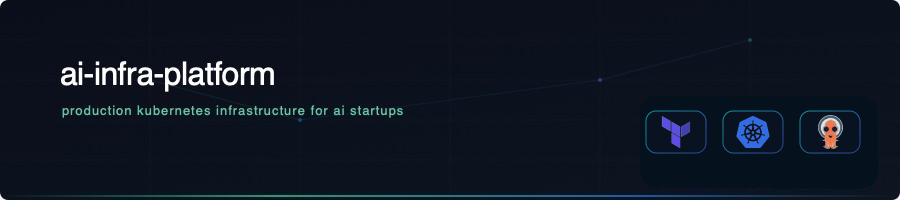
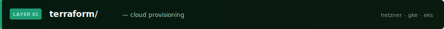
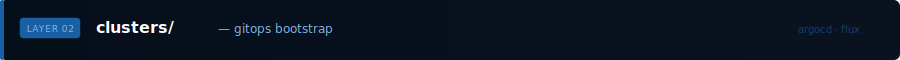
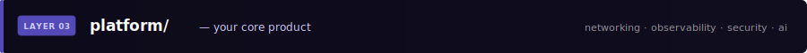
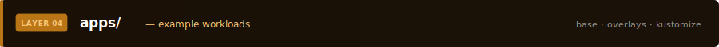
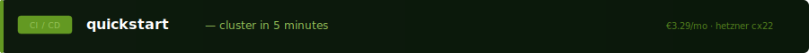

<p align="center">
  
</p>

<p align="center">
  
  
  
  
  
  
</p>

<br/>

> A modular, production-grade Kubernetes infrastructure platform for early-stage AI startups.
> Terraform provisions the cluster. ArgoCD owns everything inside it.
> Enable only the modules you need.

<br/>

---

## Architecture

Two layers. One clean handoff.

```
┌─────────────────────────────────────────────────────────┐
│  LAYER 1 — terraform/                                   │
│  Provisions cloud infrastructure via provider APIs.     │
│  Creates the cluster, DNS, storage, secrets backend.    │
│  Outputs kubeconfig → consumed by GitOps bootstrap.     │
└────────────────────────┬────────────────────────────────┘
                         │  terraform output kubeconfig
                         ▼
┌─────────────────────────────────────────────────────────┐
│  LAYER 2 — clusters/ + platform/ + apps/               │
│  ArgoCD bootstrapped once, then owns everything.        │
│  Cluster declares which platform modules are enabled.   │
│  Platform modules are opt-in Helm releases.             │
└─────────────────────────────────────────────────────────┘
```

Terraform creates the box. GitOps fills it.

---



Cloud infrastructure provisioning. One module per provider. Authenticate once with your API token, `terraform apply`, cluster is ready in ~3 minutes.

**Supported targets**

| Module | Provider | Default size | Notes |
|--------|----------|-------------|-------|
| `hetzner-k3s` | Hetzner Cloud | CX22 — €3.29/mo | Single-node k3s, ideal for dev/demo |
| `hetzner-ha` | Hetzner Cloud | 3× CX32 | HA control plane for production |
| `gke-standard` | Google Cloud | e2-standard-2 | GKE Autopilot or Standard |
| `aws-eks` | AWS | t3.medium | EKS with managed node groups |

**Authentication**

```bash
# Hetzner
export HCLOUD_TOKEN="your_token"

# GKE
export GOOGLE_CREDENTIALS="$(cat sa-key.json)"

# EKS
export AWS_ACCESS_KEY_ID="..."
export AWS_SECRET_ACCESS_KEY="..."
```

**Shared infrastructure modules**

```
terraform/shared/
  dns/              # Cloudflare or cloud DNS zone
  storage/          # S3-compatible bucket — Loki + Velero backups
  secrets-backend/  # Vault, AWS SSM, or GCP Secret Manager
```

---



Each cluster folder is a declaration: which provider module was used, which platform modules are active, and any cluster-specific value overrides. Bootstrap runs once after `terraform apply` — after that, ArgoCD owns the full reconciliation loop.

**Bootstrap sequence**

```bash
# 1. Provision infrastructure
cd terraform/modules/hetzner-k3s
terraform init && terraform apply -var-file=../../examples/hetzner-k3s.tfvars

# 2. Bootstrap ArgoCD + root app (or use the helper script)
./script/bootstrap-cluster.sh hetzner-k3s

# 3. Done — ArgoCD deploys all enabled platform modules
```

**Cluster config structure**

```yaml
# clusters/hetzner-k3s/kustomization.yaml
resources:
  - ../../platform/gitops
  - ../../platform/networking
  - ../../platform/observability
  - ../../platform/security
  - ../../platform/storage
  - ../../platform/ai/qdrant      # opt-in
  - ../../platform/ai/vllm        # opt-in
```

Enable a module by adding its path. Disable it by removing the line. ArgoCD reconciles.

---



Self-contained, opt-in Helm-based modules. Every module ships with production-grade default values, Grafana dashboards where applicable, and runbooks in `docs/runbooks/`.

**Core modules**

| Module | What it installs | Required |
|--------|-----------------|----------|
| `gitops/` | ArgoCD, Helm repo sources | Yes |
| `networking/ingress-nginx` | Ingress controller | Yes |
| `networking/cert-manager` | Let's Encrypt + ClusterIssuer | Yes |
| `networking/cloudflare-tunnel` | Zero-trust ingress (optional) | No |
| `observability/kube-prometheus-stack` | Prometheus + Grafana + Alertmanager | Yes |
| `observability/loki` | Log aggregation | Recommended |
| `security/external-secrets` | ESO + SecretStore per provider | Yes |
| `security/rbac` | Baseline ClusterRoles | Yes |
| `security/kyverno` | Policy engine | Recommended |
| `storage/velero` | Backup + restore | Recommended |

<br/>


Optional modules for AI workloads. Each is independently opt-in.

| Module | What it installs | Use case |
|--------|-----------------|----------|
| `ai/gpu/` | NVIDIA device plugin, time-slicing config | Any GPU workload |
| `ai/vllm/` | vLLM deployment + autoscaling + OpenAPI spec | LLM inference serving |
| `ai/qdrant/` | Qdrant vector DB + persistence + backup hooks | RAG, semantic search |
| `ai/postgres-operator/` | CloudNativePG + connection pooling + backups | Relational data |
| `ai/redis/` | Redis + Sentinel | Caching, queues |
| `ai/argo-workflows/` | Workflow engine + templates + artifact storage | ML pipelines |

---



A single generic example showing how application workloads plug into the platform layer using Kustomize base/overlays.

```
apps/_example/
  base/
    deployment.yaml    # generic app, references platform ingress + secrets
    service.yaml
    kustomization.yaml
  overlays/
    production/
      patch-resources.yaml   # environment-specific overrides
      kustomization.yaml
```

This is the pattern client workloads follow. The platform layer handles everything else.

---



**Prerequisites**

```bash
# Required
terraform >= 1.7
kubectl >= 1.29
helm >= 3.14
argocd CLI >= 2.10

# Optional but recommended
k9s    # cluster UI
trivy  # security scanning
```

**Spin up a full cluster in one command**

```bash
# Clone the repo
git clone https://github.com/your-username/ai-infra-platform
cd ai-infra-platform

# Configure your target
cp terraform/examples/hetzner-k3s.tfvars.example terraform/examples/hetzner-k3s.tfvars
# → edit with your Hetzner token, domain, region

# Bootstrap everything
export HCLOUD_TOKEN="your_token"
./script/bootstrap-cluster.sh hetzner-k3s

# Verify all modules are healthy
./script/verify-platform.sh
```

**Tear it down cleanly**

```bash
./script/destroy-cluster.sh hetzner-k3s
```

Useful for demo environments — spin up before a call, destroy after.

---

## CI

Every push to `main` runs three workflows:

| Workflow | What it does |
|----------|-------------|
| `lint.yaml` | `helm lint`, `kustomize build`, `terraform validate` across all modules |
| `smoke-test.yaml` | Provisions a real Hetzner CX22, deploys core platform modules, runs `verify-platform.sh`, destroys |
| `security-scan.yaml` | Trivy + Checkov scan across all Terraform and Kubernetes manifests |

The smoke test runs against a real cluster on every push. If the badge is green, the platform deploys.

---

## Repository structure

```
ai-infra-platform/
├── terraform/
│   ├── modules/          # one module per cloud provider
│   ├── shared/           # dns, storage, secrets-backend
│   └── examples/         # .tfvars.example per target
├── clusters/
│   ├── bootstrap/        # argocd install + root app
│   ├── hetzner-k3s/      # cluster config — module selection
│   └── gke-standard/
├── platform/
│   ├── gitops/
│   ├── networking/
│   ├── observability/
│   ├── security/
│   ├── storage/
│   └── ai/               # gpu, vllm, qdrant, postgres, redis, workflows
├── apps/
│   └── _example/         # base + overlays pattern
├── script/               # bootstrap, destroy, verify, new-client
├── .github/workflows/    # lint, smoke-test, security-scan
└── docs/
    ├── architecture/
    ├── conventions/
    ├── runbooks/
    └── troubleshooting/
```

---

## Documentation

| Document | Description |
|----------|-------------|
| [Cluster topology](./docs/architecture/cluster-topology.md) | Full architecture diagram and layer explanation |
| [Terraform → GitOps handoff](./docs/architecture/terraform-gitops-handoff.md) | How provisioning and GitOps connect |
| [Adding a module](./docs/conventions/module-structure.md) | How to add a new platform module |
| [Restore from backup](./docs/runbooks/restore-velero-backup.md) | Velero restore procedure |
| [Rotate secrets](./docs/runbooks/rotate-secrets.md) | External secrets rotation |
| [ArgoCD sync failures](./docs/troubleshooting/argocd-sync-failures.md) | Common sync issues and fixes |

---

<br/>

<p align="center">
  <sub>Built and maintained as part of a fractional AI infrastructure service for early-stage startups.<br/>
  Need this running for your team? <a href="https://your-service-page-url">Learn more →</a></sub>
</p>
